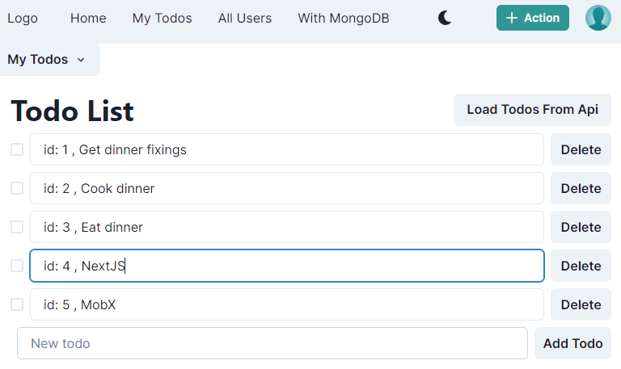
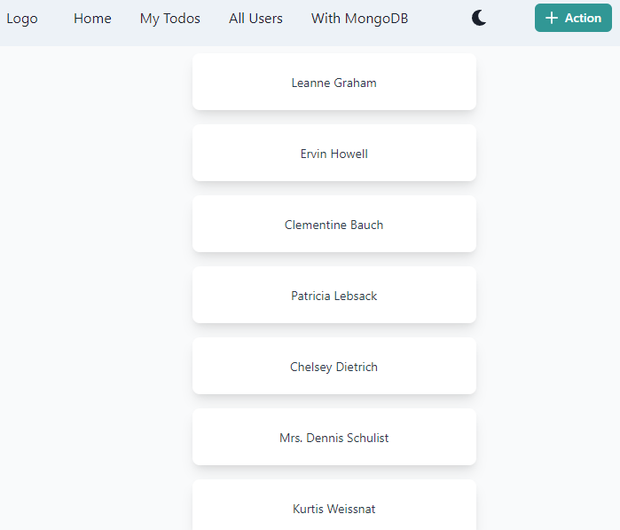

### 📸 learn-nextjs14-mobx




#### This template is created using six different MobX state manager examples for different use cases.

#### This is a task management system application that allows users to create, track, and manage their tasks.

## 📖 TODO

- Recycle knowledge and refresh mind
- < code />

-------------------------------------------------

### ⚙️ Technology Stack


-------------------------------------------------

### 📝 Local State management

Mobx data is stored in local storage.

[//]: # (![Reducer]&#40;https://img.shields.io/badge/Reducer-%2320232a.svg?style=for-the-badge&logo=react&logoColor=%2361DAFB&#41;)


-------------------------------------------------

### ‍💻 Getting Started

```bash
npm run dev
# or
yarn dev
```

-------------------------------------------------

### 🌐 Learn More

> This is a [Next.js](https://nextjs.org/)

#### 💡 Additional:

```bash 
npm i @chakra-ui/react
# 
npm install react-icons --save
# 
npm i mobx-react-lite
# 
npm i @chakra-ui/icons
# 
npm install axios
# 
npm i mobx
```


